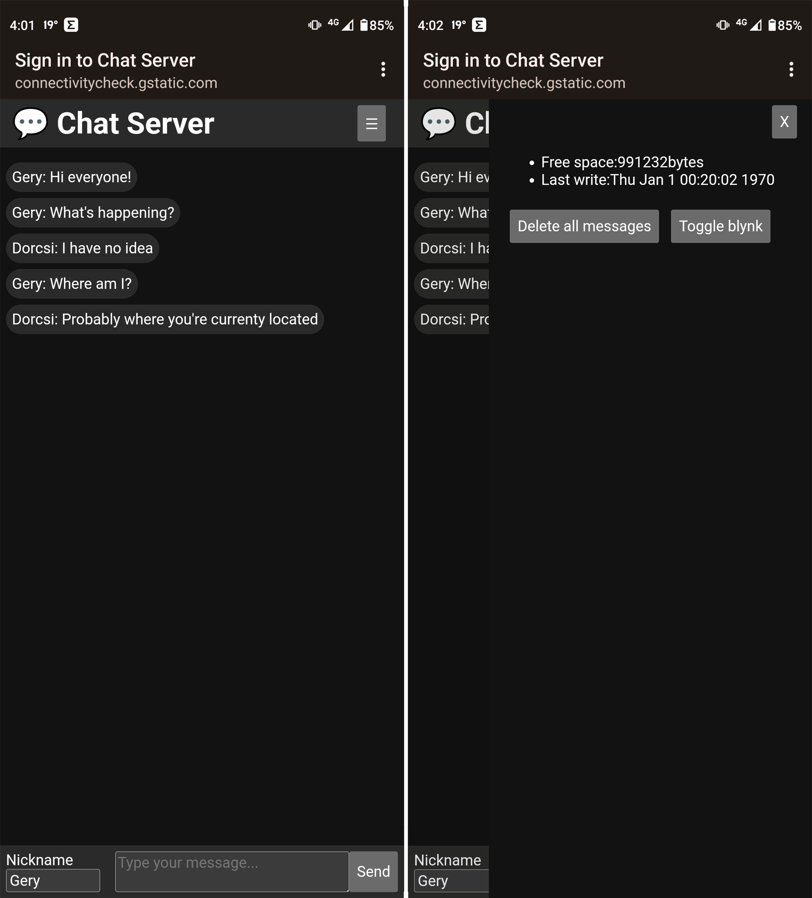
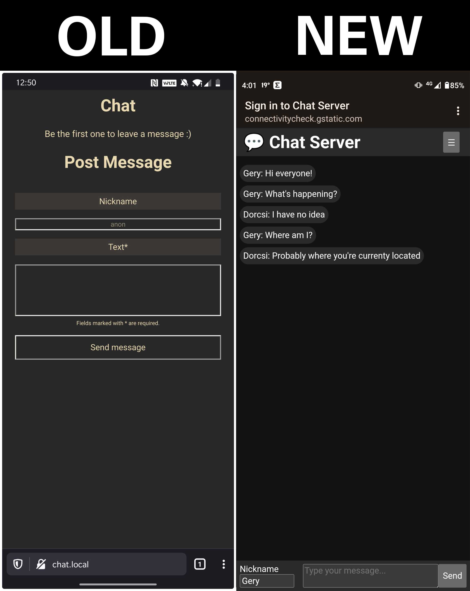

# 💬 esp8266Chat
  
You can make a standalone local chat server which works without the internet from your ESP8266 NodeMCU.

## Features

When you connect the ESP to the power, it creates a WiFi network and hosts a local chat server. You can send messages to a public channel, without the internet and read it.

The ESP stores the messages in its EEPROM, so your messages remain after a server reboot. In the off-canvas menu, you can check how much space is left in the disk and empty the storage.

By default, the NodeMCU blinks its built-in LED every second. You can turn this off in the menu.

## My Improvenents

This project is based on [Kuuhhl's esp8266Chat](https://github.com/Kuuhhl/esp8266Chat), but has many improvements.

* 📱 New, modern, responsive, mobile-friendly, lightweight (1 kb) theme
* 🚀 Performance boost: browser side caching, gzipped files, fewer HTTP request
* 📈 Display telemetry data
* 👨‍⚕️ Better browswer support (HTML errors fixed)
* 💡 Toggleable built-in LED blinking
* 📖 Lot of code refactoring
* 📖 Documentation extensions

## Installation (for NodeMCU)

1. Download the [latest release](https://github.com/BarnaGergely/esp8266Chat/releases) `.bin` files.
2. Download and install [esptool.py](https://github.com/espressif/esptool).
3. Flash the `.bin` files using this command: `esptool.py write_flash 0x0 firmware.bin 0x00300000 littlefs.bin`.

## Usage

1. Connect the esp8266 to a powerbank.
2. Connect to the newly created Wifi-Hotspot `Chat Server`.
3. Open any URL in your browser, it should automatically redirect you. (it doesn't work? try to replace `https://` in your URL with `http://`.)

## Manually building and uploading the project

1. Install [VS Code](https://code.visualstudio.com/) and [PlatformIO extension](https://marketplace.visualstudio.com/items?itemName=platformio.platformio-ide)
2. Clone (download) the repository from Github
3. Open the project with PlatformIO
4. To change theme you have to copy the selected theme minified and gzipped `index.html.gz` file to the `data` folder (the PlatformIO uses this folder to build the file system image for the ESP)
5. Build and upload the code with the `General/Build` button
6. Build the file system image with the `Platform/Build Filesystem Image` button
7. Upload the file system image with the `Platform/Upload Filesystem Image` button

## Theme compression process

1. Copy `index.html` to compressed folder
2. Minify CSS and copy to the `<style>` tag: [https://www.toptal.com/developers/cssminifier](https://www.toptal.com/developers/cssminifier)
3. Minify JavaScript and copy to the `<script>` tag: [https://www.toptal.com/developers/javascript-minifier](https://www.toptal.com/developers/javascript-minifier)
4. Minify HTML: [https://codebeautify.org/minify-html](https://codebeautify.org/minify-html)
5. Gzip HTML: [https://gzip.swimburger.net/](https://gzip.swimburger.net/)
6. Copy the combined, minified, and compressed HTML to the `data` folder

## Minify and compress theme

We do some optimalizations on the website before uploading to the ESP. to make it as small ass possible. This task can be automatized. This can be done with Python (`extra_script.py`) or with Marlin, but it is not working yet, so we need to do mannally.

#### Manual method

1. Minify CSS: [https://www.toptal.com/developers/cssminifier](https://www.toptal.com/developers/cssminifier)
2. Minify JS: [https://www.toptal.com/developers/javascript-minifier](https://www.toptal.com/developers/javascript-minifier)
3. Combine HTML CSS, JS into one HTML file
4. Minify the combined HTML [https://www.toptal.com/developers/html-minifier](https://www.toptal.com/developers/html-minifier)
5. Gzip the combined HTML [https://gzip.swimburger.net/](https://gzip.swimburger.net/)

## Endpoints

* `/` default landing page.
* ~~`/styles.css` css styles for the landing page.~~ *- removed, because the CSS merged to one HTML file*
* ~~`/scripts.js` js scripts for the landing page.~~ *- removed, because the JS merged to one HTML file*
* `/sendText` POST endpoint to send a new message. Parameters: `nickname`, `text`.
* `/showText` content of messages.txt file.
* `/lastWrite` timestamp of last write.
* `/clear` clear all messages.
* `/toogleBlynk` toogle led blynking function. Returns the actual state of blynking (`0` or `1`).
* `/getFreeSpace` free space in the eeprom in bytes

## Backlog

* [ ] Use Websocket insted of REST API
* [ ] Automate data minify, gzip, compress, build Filesystem image and upload Filesystem image
* [ ] Improve UI Design to look like Messenger, with animations
* [ ] Tranform the frontend to a PWA
* [ ] Notifications

