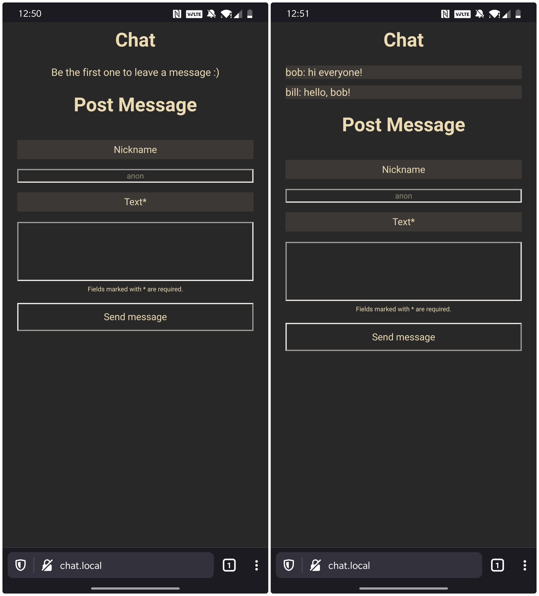

 

  

  <h3 align="center">esp8266Chat</h3>
  
a simple chat server for the esp8266.

## Tasks

- [ ] Automate data minify, gzip, compress, build Filesystem image and upload Filesystem image
- [ ] Improve UI Design
- [ ] Optimize UI code
- [ ] Improve tools page

## Compression process

1. Copy index.html to compressed folder
2. Minify css and copy to the <style> tag: https://www.toptal.com/developers/cssminifier
3. Minify JavaScript and copy to the <script> tag: https://www.toptal.com/developers/javascript-minifier
4. Minify HTML: https://codebeautify.org/minify-html
5. Gzip HTML: https://gzip.swimburger.net/
6. Copy the combined, minified, and compressed html to data folder

## Screenshots

## Installation (for NodeMCU)
1. Download the [latest release](https://github.com/Kuuhhl/esp8266Chat/releases/) `.bin` files.
2. Download and install [esptool.py](https://github.com/espressif/esptool).
3. Flash the `.bin` files using this command: `esptool.py write_flash 0x0 firmware.bin 0x00300000 littlefs.bin`.

## Usage
1. Connect the esp8266 to a powerbank.
2. Connect to the newly created Wifi-Hotspot `Chat Server`.
3. Open any URL in your browser, it should automatically redirect you. (it doesn't work? try to replace `https://` in your URL with `http://`.)

## Endpoints
* `/` default landing page.
* `/styles.css` css styles for the landing page.
* `/scripts.js` js scripts for the landing page.
* `/sendText` POST endpoint to send a new message. Parameters: `nickname`, `text`.
* `/showText` content of messages.txt file.
* `/lastWrite` timestamp of last write.
* `/clear` clear all messages.

